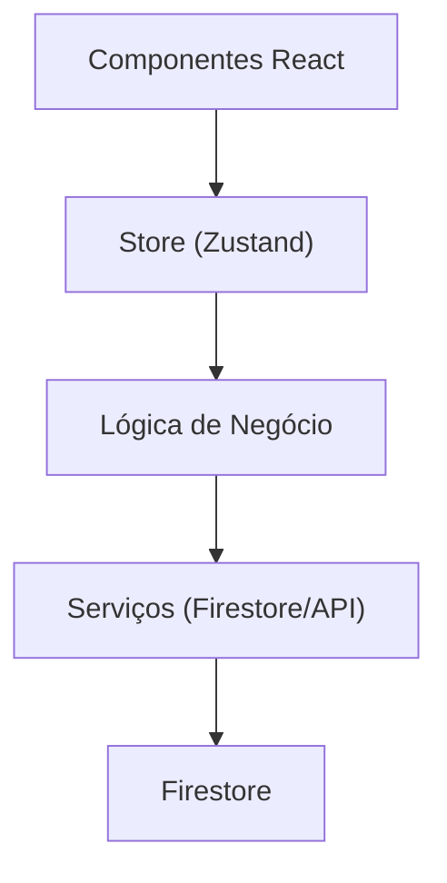

# Arquitetura do Projeto

## Estrutura de Pastas

- **app/**: Rotas e páginas principais (Expo Router/Next.js)
- **components/**: Componentes de UI reutilizáveis
- **constants/**: Constantes globais (ex: cores)
- **contexts/**: Contextos React (ex: AuthContext)
- **docs/**: Documentação do projeto
- **hooks/**: Custom hooks
- **logic/**: Lógica de negócio (validações, cálculos, regras)
- **services/**: Serviços de acesso a dados (Firestore, APIs, AsyncStorage)
- **stores/**: Gerenciamento de estado global (Zustand)
- **types/**: Tipos e interfaces TypeScript centralizados
- **tests/**: Testes unitários e de integração
- **assets/**: Imagens, fontes, etc
- **scripts/**: Scripts utilitários

## Fluxo de Dados

## Padrões Adotados
- **Tipos centralizados** em `types/`.
- **Lógica de negócio** separada em `logic/`.
- **Acesso a dados** apenas em `services/`.
- **Estado global** em `stores/`.
- **UI desacoplada** de lógica e dados.

## Boas Práticas
- Sempre validar dados antes de salvar no banco.
- Testes unitários para lógica e serviços.
- Documentação atualizada para Firestore e arquitetura. 